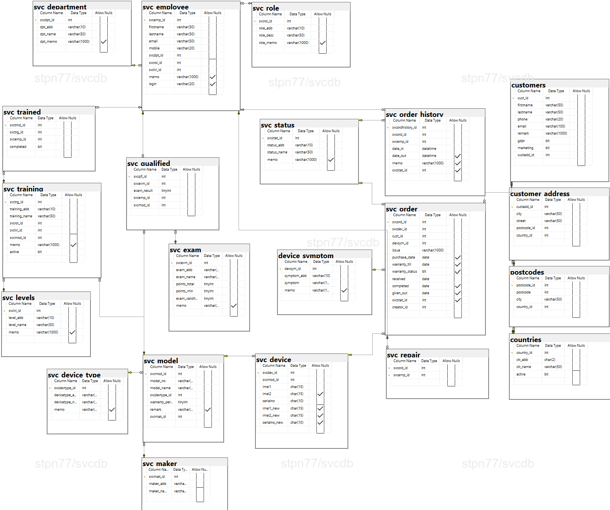

# SVCdb: Database for service operations
Purpose of SVCdb database is to store data necessary for service center operations and support its operations based on data available. Database in this status represents minimum level which is necessary to handle customers, employess connected to repair process, devices received for repair and service orders as core of operations.

**Simplification**
SVCdb is designed to support multi-country, multi-manufacture, multi-device operations but sample data used cover only hungarian customers, two manufacturers and mobile phones and tablets. With modifications, database accepts data in format for other countries, etc. 

**Data sources for sample data**
1. customers - all the test data used in database are randomly generated data. No real/existing data was used as source.
2. employees - all the test data used in database are randomly generated data. No real/existing data was used as source.
3. addresses  - all the test data used in database are randomly generated data. No real/existing data was used as source.
4. phone numbers - all the test data used in database are randomly generated data to match numbering standard. No real/existing data was used as source. 
5. models - publicly available data used
6. IMEI numbers and serial numbers - randomly generated data to match numbering standard.

**General description of Service process** 
1. customer brings device to service center for repair:
Customer's personal data need to be registered together with the device given for repair. Device is accepted for repair if matching the directory manufacturer/model data, warranty repair and out of warranty repair is shown matching the base criteria. 
2. repair process
When device handled by initial administration, it is assigned to service employee who is authorized to handle repair after completed training and exam for particular model. Standard repair process follows this flow: 
	incoming administration - test for symptom - repair of device - test for functionality - outgoing administration.
3. customer picks up device from service center after repair.

**Database diagram**

**Installation**
Database installation is done via schema.sql script is optimized for Windows systems.
Test data installation is done via data.sql script.
Both scripts need to be run via suitable environment as described bellow.

_Prerequisites_
	- MS SQL server Enterprise or Developer edition, min 2019 version,
	- SQL server management studio, min version 18.x.x or Azure Data Studio 1.36.x,
	- 10MB free space 

**Backup/restore strategy**

_Backup plan_
To maintain integrity a security of database, full recovery mode is in place. Regular backup routine is set with one full backup done daily and transaction logs backup on 4hours schedule.

Full backups are taken every day Monday to Sunday at 00:30 to file called SVCdb.bak located on location C:\backup\

Transaction log backups are taken every day in 4hour intervals (Monday-Sunday at 08:00, 12:00, 16:00, 20:00) to a file called SVCdb-logs.bak located on location C:\backup\
	
_Restore plan_
In case a user error (accidental `DELETE`) the plan is to restore data from the last available transaction log backup. In case of catastrophic failure, data restoration is made from the full backup.

Notice: Both backup and restore plans are simplified. Backup locations need to be adjusted based on availabilitz in order to have securely stored backups.

**Full documentation**
Full documentation is available [here](SVCdb_documentation_en.pdf).

